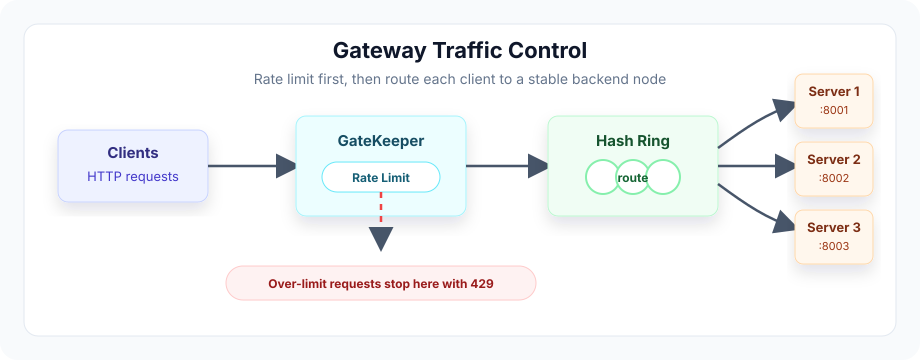

# GateKeeper-Core



GateKeeper-Core is a lightweight FastAPI-based API gateway that forwards client traffic to a pool of backend nodes while applying per-client rate limiting and consistent-hash routing.

The project is designed as a small, readable gateway core: requests enter through one public gateway, pass through middleware for traffic control, and are then proxied to a stable backend node selected from a consistent hash ring. It also includes Redis-backed distributed rate limiting, backend health monitoring, Prometheus metrics, and structured request-ID logging.

## Features

- Reverse proxy for forwarding HTTP requests to backend services
- Consistent hashing for stable client-to-node routing
- In-memory or Redis-backed sliding-window rate limiting per client IP
- Redis state layer for horizontally scaled gateway deployments
- Backend health checker with automatic hash-ring removal and recovery
- Prometheus `/metrics` endpoint for gateway observability
- Structured JSON logs with propagated `X-Request-ID` tracing
- Configurable backend node list through environment variables
- Response metadata headers for observability
- Docker and Docker Compose support for local multi-service testing
- Mock backend service for gateway verification

## Architecture

```text
Client
  |
  v
Gateway FastAPI app :8000
  |
  v
GatekeeperMiddleware
  |
  |-- health/admin route bypass
  |-- client IP extraction
  |-- in-memory or Redis sliding-window rate limit check
  |-- consistent hash node selection
  |-- request-ID propagation
  |-- proxy latency measurement
  |-- Prometheus metric updates
  |
  v
Selected backend node
  |
  v
Backend response returned to client
```

The gateway exposes a catch-all route so application traffic can enter FastAPI, but the actual gateway behavior lives in middleware. The middleware decides whether a request is allowed, selects a backend node, forwards the request, and appends gateway metadata headers to the response.

## Project Structure

```text
.
├── app
│   ├── config.py                    # Environment-backed gateway settings
│   ├── main.py                      # FastAPI app, health route, middleware registration
│   ├── core
│   │   ├── hash_ring.py             # Consistent hash ring implementation
│   │   ├── health_checker.py        # Active backend health monitoring
│   │   ├── proxy.py                 # Async HTTP forwarding with httpx
│   │   ├── rate_limiter.py          # In-memory sliding-window rate limiter
│   │   ├── redis_limiter.py         # Redis-backed distributed rate limiter
│   │   └── telemetry.py             # Prometheus metrics and JSON logging helpers
│   └── middleware
│       └── guard_middleware.py      # Gateway request-control middleware
├── tests
│   ├── mock_backend.py              # Simple backend worker used for local testing
│   ├── test_hash_ring.py            # Hash ring behavior tests
│   └── test_rate_limiter.py         # Rate limiter behavior tests
├── Dockerfile                       # Container image definition
├── docker-compose.yml               # Gateway + backend worker stack
├── requirements.txt                 # Python dependencies
└── .env.example                     # Example runtime configuration
```

## Request Flow

1. A client sends a request to the gateway, for example `GET /api/v1/test`.
2. `GatekeeperMiddleware` ignores internal routes such as `/healthz`.
3. The middleware identifies the client by IP address.
4. The selected rate limiter checks whether the client is still within its request budget.
5. The consistent hash ring maps the client IP to one backend node.
6. The gateway adds or preserves `X-Request-ID` for traceability.
7. `app.core.proxy.forward_request()` forwards the original method, path, query string, headers, cookies, body, and request ID to the selected backend.
8. The gateway records Prometheus metrics and structured JSON logs.
9. The gateway returns the backend response with gateway headers attached.

Example response headers:

```text
X-RateLimit-Remaining: 99
X-Target-Node: http://localhost:8001
X-Proxy-Latency-Ms: 12.34
X-Request-ID: 6f6a4f6c-7f6c-4c9c-ae70-9d377c56e8cf
```

## Configuration

Runtime configuration is managed by `pydantic-settings` in `app/config.py`.

| Variable | Default | Description |
| --- | --- | --- |
| `GATEWAY_PORT` | `8000` | Intended gateway port |
| `DEFAULT_RATE_LIMIT` | `100` | Maximum requests allowed per client window |
| `RATE_LIMIT_WINDOW_SECONDS` | `60` | Sliding-window duration in seconds |
| `BACKEND_NODES` | `http://localhost:8001,http://localhost:8002,http://localhost:8003` | Comma-separated backend node URLs |
| `RATE_LIMIT_BACKEND` | `redis` | Rate-limit storage backend. Use `memory` or `redis` |
| `REDIS_URL` | `redis://localhost:6379/0` | Redis connection URL used when `RATE_LIMIT_BACKEND=redis` |

Create a local `.env` from the example if you want to override defaults:

```bash
cp .env.example .env
```

## Local Development

Install dependencies:

```bash
python3 -m venv venv
source venv/bin/activate
pip install -r requirements.txt
```

Start three mock backend workers in separate terminals:

```bash
uvicorn tests.mock_backend:app --host 127.0.0.1 --port 8001
uvicorn tests.mock_backend:app --host 127.0.0.1 --port 8002
uvicorn tests.mock_backend:app --host 127.0.0.1 --port 8003
```

Start the gateway:

```bash
uvicorn app.main:app --host 127.0.0.1 --port 8000
```

Send traffic through the gateway:

```bash
curl -i http://127.0.0.1:8000/api/v1/test
```

Check gateway health:

```bash
curl http://127.0.0.1:8000/healthz
```

Check Prometheus metrics:

```bash
curl http://127.0.0.1:8000/metrics
```

## Docker

Build and run the full local stack with Docker Compose:

```bash
docker compose up --build
```

This starts:

- `gateway` on host port `8000`
- `backend1` on host port `8001`
- `backend2` on host port `8002`
- `backend3` on host port `8003`
- `redis` on host port `6379`

Inside Docker Compose, the gateway uses service names instead of `localhost`:

```text
http://backend1:8001,http://backend2:8002,http://backend3:8003
```

That distinction matters because `localhost` inside a container points to the container itself, not another service.

The Compose stack uses Redis rate limiting by default:

```yaml
RATE_LIMIT_BACKEND: redis
REDIS_URL: redis://redis:6379/0
```

The included Compose file sets `DEFAULT_RATE_LIMIT` to `3` so rate-limit behavior is easy to observe during local testing. Increase it for normal development.

Verify Redis:

```bash
docker compose exec redis redis-cli ping
```

Expected response:

```text
PONG
```

Inspect rate-limit keys:

```bash
docker compose exec redis redis-cli keys '*'
```

## Observability

GateKeeper-Core exposes gateway metrics at:

```text
GET /metrics
```

Useful custom metrics include:

```text
gatekeeper_rate_limit_rejections_total
gatekeeper_proxy_requests_total
gatekeeper_proxy_latency_seconds
```

Example:

```bash
curl -s http://localhost:8000/metrics | grep gatekeeper
```

Every proxied request also receives an `X-Request-ID`. If a client sends one, the gateway preserves it. If not, the gateway generates one and forwards it upstream.

```bash
curl -i -H "X-Request-ID: demo-123" http://localhost:8000/api/v1/test
```

Search gateway logs by request ID:

```bash
docker compose logs gateway | grep demo-123
```

Example structured log:

```json
{"event": "request_proxied", "request_id": "demo-123", "client_ip": "192.168.65.1", "method": "GET", "path": "/api/v1/test", "target_node": "http://backend2:8002", "status_code": 200, "latency_ms": "12.81"}
```

## Health Checking

The gateway starts a background health checker during application startup. It periodically calls `/health` on each configured backend node.

When a node fails enough consecutive checks, it is removed from the hash ring:

```text
[HealthChecker] Circuit breaker tripped for http://backend1:8001. Removing from hash ring.
```

When the node recovers, it is re-added:

```text
[HealthChecker] Node http://backend1:8001 recovered. Re-adding to hash ring.
```

Test with Docker Compose:

```bash
docker compose stop backend1
docker compose logs -f gateway backend1
docker compose start backend1
```

## Testing

Run the hash ring test:

```bash
pytest -q tests/test_hash_ring.py
```

Run the rate limiter test module directly:

```bash
python3 tests/test_rate_limiter.py
```

The rate limiter tests are async. To run them through `pytest`, add an async pytest plugin such as `pytest-asyncio` and mark/configure the async tests accordingly.

## Core Components

### `ConsistentHashRing`

`app/core/hash_ring.py` maps client keys to backend nodes using virtual nodes. This keeps routing stable: the same client usually lands on the same backend, and removing a backend only remaps the keys that belonged to that backend.

### `SlidingWindowRateLimiter`

`app/core/rate_limiter.py` tracks request timestamps per client and rejects requests once the configured limit is exceeded within the active time window. An async lock protects the in-memory counters during concurrent access.

### `RedisSlidingWindowRateLimiter`

`app/core/redis_limiter.py` stores request timestamps in Redis sorted sets. A Lua script atomically removes expired timestamps, counts active requests, accepts or rejects the new request, and sets key expiration. This allows multiple gateway replicas to enforce one shared rate-limit budget.

### `HealthChecker`

`app/core/health_checker.py` monitors backend `/health` endpoints. Unhealthy nodes are removed from the consistent hash ring, and recovered nodes are added back automatically.

### `GatekeeperMiddleware`

`app/middleware/guard_middleware.py` is the main gateway control point. It applies rate limiting, selects a target backend, forwards traffic, handles proxy errors, records metrics, emits structured logs, and attaches gateway metadata headers.

### `forward_request`

`app/core/proxy.py` performs async HTTP forwarding with `httpx`. It reconstructs the target URL, preserves the incoming request method and body, removes the original `Host` header, and returns the backend response to the client.

### `telemetry`

`app/core/telemetry.py` configures Prometheus instrumentation and structured JSON logging. It defines gateway-specific counters and histograms for rate-limit rejections, proxy request totals, and proxy latency.

## Current Limitations

- Node membership is loaded at startup and is not dynamically rebalanced at runtime.
- The proxy currently buffers request and response bodies instead of streaming them.
- Client identity is based on `request.client.host`; deployments behind another reverse proxy may need trusted forwarded-header handling.
- Redis failures currently bubble up instead of falling back to in-memory limiting or fail-open behavior.
- Health-check configuration is currently hard-coded in the checker class.

## Future Scope

- Add request/response streaming for large payloads
- Add configurable health-check interval and failure thresholds
- Add dashboards and alert rules for Prometheus metrics
- Add pytest async support and end-to-end proxy tests
- Add admin APIs for inspecting nodes and rate-limit state

---

<p align="center">
  Built by <strong>Richa Gupta</strong>
</p>
